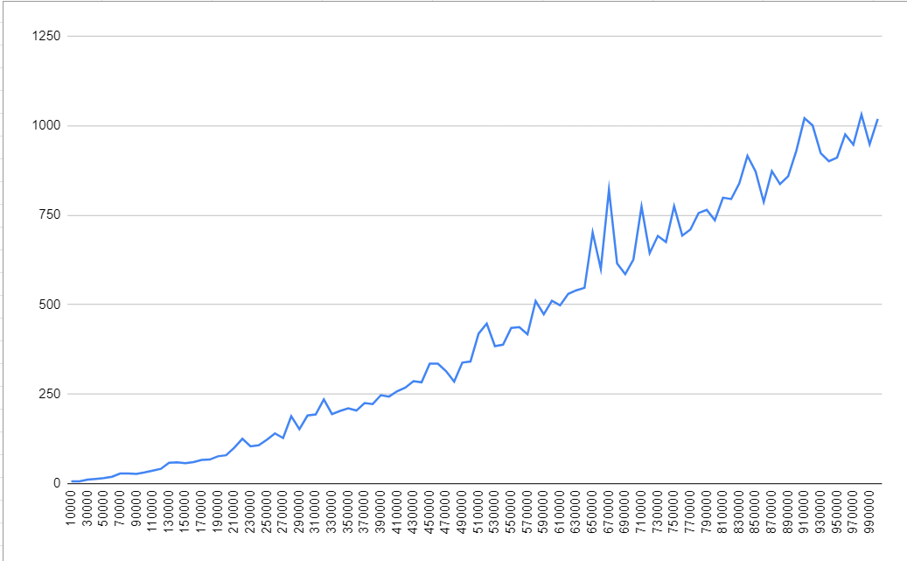

# Description
This repo contains the implementation and testing og two algorithms: Red-Black Balanced Tree and Counting Sort. 
To run the program, in Main.main() uncomment needed test lines.

## Red-Black Balanced Trees
Implementation was tested by 100 data samples (random integers). First sample has 10k records.
Each next sample has +10k records. Therefore, biggest sample contains 100k records.
Result of each operation performance is generated to csv files in the project root folder.
First column is dataset size. Second column is time that took algorithm to perform task in ms.
Each operation type timing correlates to each other. So I generated graph only for put operation:

We can see, that complexity is O(log(n))

## Counting Sort important points
- Counting sort is efficient if the range of input data is not significantly greater than the number of objects to be sorted. Consider the situation where the input sequence is between the range 1 to 10K and the data is 10, 5, 10K, 5K. 
- It is not a comparison-based sorting. Its running time complexity is O(n) with space proportional to the range of data. 
- Counting sorting is able to achieve this because we are making assumptions about the data we are sorting.
- It is often used as a sub-routine to another sorting algorithm like the radix sort. 
- Counting sort uses partial hashing to count the occurrence of the data object in O(1).
- The counting sort can be extended to work for negative inputs also.
- Counting sort is a stable algorithm. But it can be made stable with some code changes.

# Profiler result

1. CPU flame graph

2. Memory flame graph

As we can see, cpu and memory consumption is logarithmic for put and delete operation. Get operation isn't displayed here due to insignificance comparing to put and delete.

